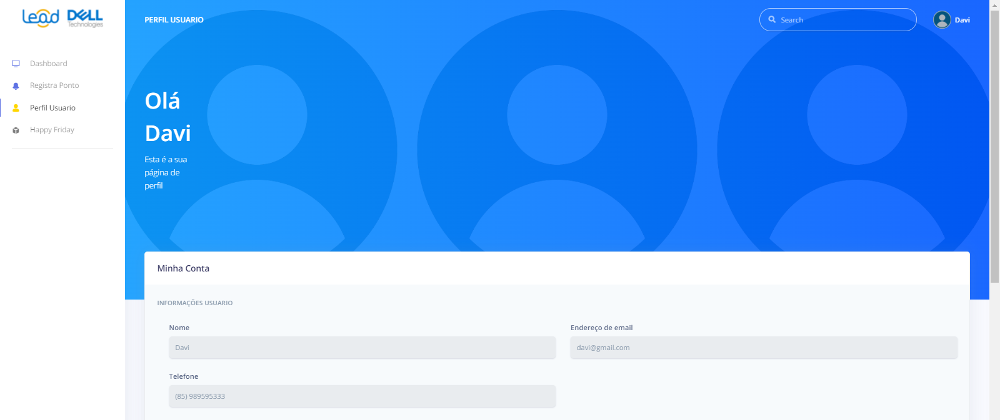
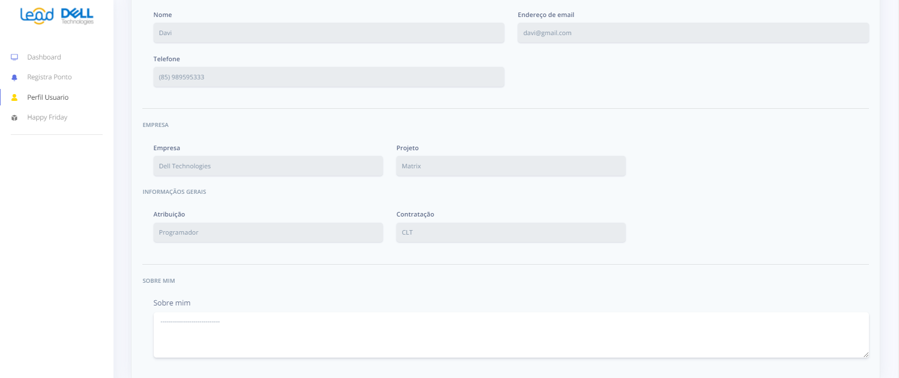
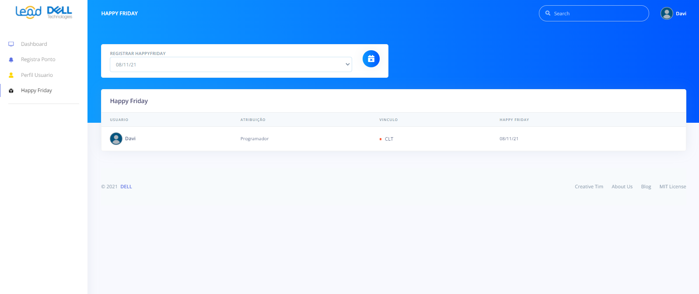
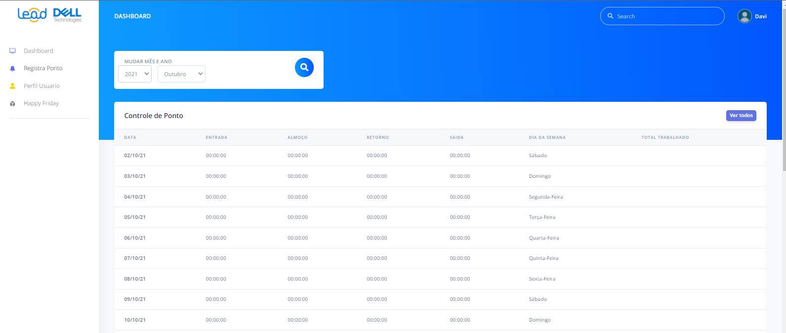
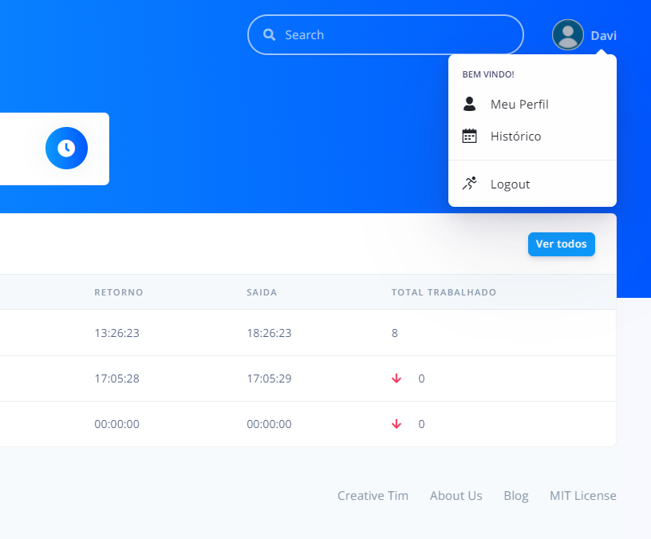

<h1>Front-End Controle de ponto</h1>
<h2>Front-End da aplicação <a href="https://github.com/DaviFT3/Controle-de-Ponto">Controle de Ponto</a> </h2>
<h3>Front desenvolvido utilizando o framework Angular e o template <a href="https://www.creative-tim.com/product/argon-dashboard">Argon</a></h3>
<h2>Tela de Login</h2>

<h2>Tela de dashboard</h2>

<h3>Nessa tela o usuário consegue visualizar os horários dos seus 7 últimos dias trabalhados, sua carga horária e seu saldo de horas. </h3>
<h2>Tela de registro de ponto</h2>

<h3>Aqui o usuário será capaz de registrar seu ponto sendo avisado com um pop up  de sucesso, após todos os pontos do dia batidos não será mais possível bater ponto</h3>
<h2>Tela de Perfil de Colaborador</h2>

<h3>Nessa tela será mostrada as informações a respeito do usuário</h3>
<h2>Tela de registro de HappyFriday(Folga)</h2>

<h3>A tela de HappyFriday permite que o usuário cadastre sua folga, não permitindo o cadastro de duas na mesma data</h3>
<h2>Tela de ver todos</h2>

<h3>A tela de ver todos permite que o usuário veja seus horários registrados por mês</h3>
<h2>E por fim o  usuário pode fazer o logout a qualquer momento clicando no canto superior direito e a opção será mostrada</h2>
